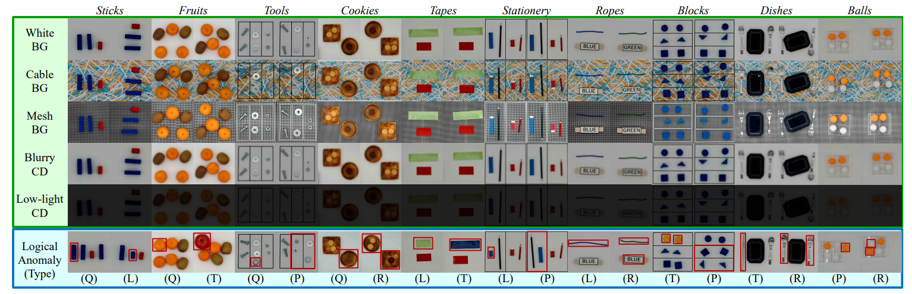
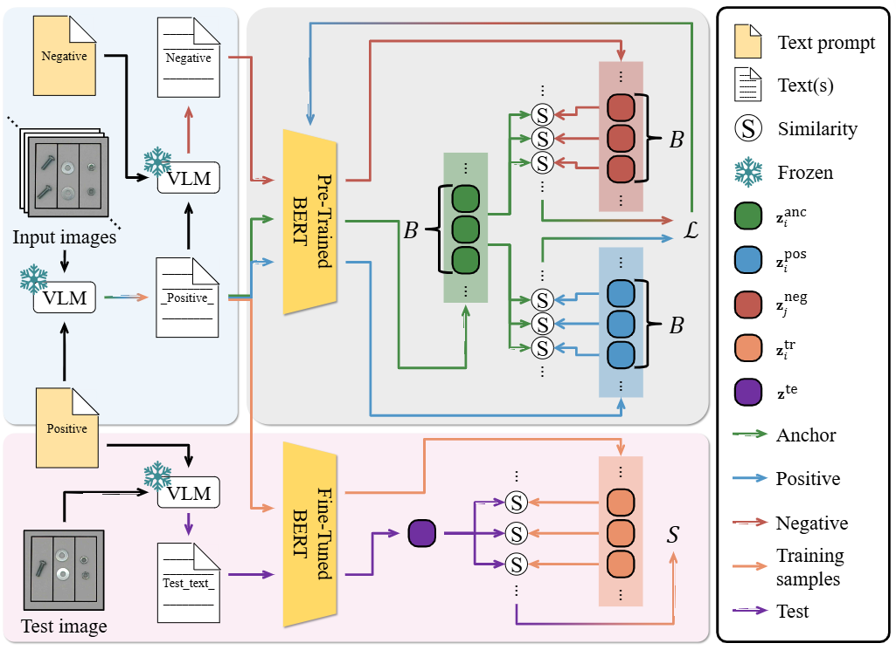
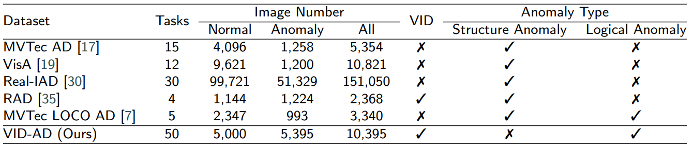
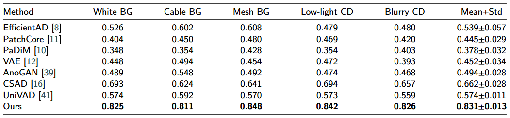
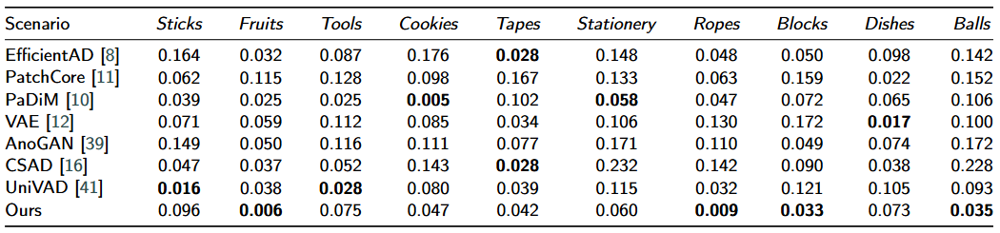
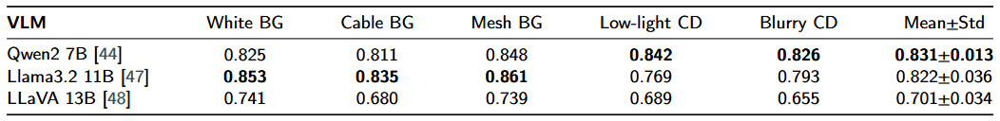

# VID-AD: A Dataset for Image-Level Logical Anomaly Detection under Vision-Induced Distraction

<p align="left">
    <a href='https://arxiv.org/abs/2603.13964'>
      
    </a>
    <a href='https://drive.google.com/file/d/1_UaWAuylvaErnvOq0uxq4gIg_NeSUNdz/view?usp=sharing'>
      
    </a>
</p>

## Abstract

<!-- TODO: Replace with actual abstract -->
Logical anomaly detection in industrial inspection remains challenging due to variations in visual appearance (e.g., background clutter, illumination shift, and blur), which often distract vision-centric detectors from identifying rule-level violations. 
However, existing benchmarks rarely provide controlled settings where logical states are fixed while such nuisance factors vary.
To address this gap, we introduce VID-AD, a dataset for logical anomaly detection under vision-induced distraction, containing 10 manufacturing scenarios and five capture conditions, which yields 50 one-class tasks and 10,395 images.
Each scenario is defined by two logical constraints (from quantity, length, type, placement, and relation) and includes both single-constraint and combined violations.
We further propose a language-based anomaly detection framework that relies solely on text descriptions generated from normal images.
Using contrastive learning with positive texts and contradiction-based negative texts synthesized from these descriptions, our method learns embeddings that emphasize logical content rather than low-level appearance.
Extensive experiments demonstrate consistent improvements over baselines across the evaluated settings.

## Overview

<p align="center">
  
</p>

## Method

<p align="center">
  
</p>

Our language-based anomaly detection framework leverages Vision Language Models (VLMs) to generate textual descriptions of normal images. We employ contrastive learning with BERT, using positive sentences from normal images and contradiction-based negative sentences to learn embeddings that emphasize logical content over low-level appearance variations.

## Dataset

### Download

<!-- TODO: Replace with actual dataset URL -->
The dataset can be downloaded from [here](https://drive.google.com/file/d/1_UaWAuylvaErnvOq0uxq4gIg_NeSUNdz/view?usp=sharing).

### Dataset Structure

```
VID-AD_dataset/
├── {Category}/                    # e.g., Balls, Blocks, Cookies, ...
│   ├── train/
│   │   └── good/                  # Normal training video frames
│   └── test/
│       ├── good/                  # Normal test video frames
│       └── logical_anomalies/     # Anomalous test video frames
│           ├── Single-Aspect-A/
│           ├── Single-Aspect-B/         # (varies by category)
│           └── Dual-Aspects/
├── {Category}_Cable_BG/           # Cable Background
├── {Category}_Mesh_BG/            # Mesh Background
├── {Category}_Blurry_CD/          # Blurry Condition
└── {Category}_Low-light_CD/       # Low-light Condition
```

**10 Scenarios:** *Balls*, *Blocks*, *Cookies*, *Dishes*, *Fruits*, *Ropes*, *Stationery*, *Sticks*, *Tapes*, *Tools*

**Five Capture Conditions:** Original, Cable_BG, Mesh_BG, Low-light_CD, Blurry_CD

### Dataset Statistics

<p align="center">
  
</p>

## Results

Our method demonstrates consistent improvements over existing baseline methods across all capture conditions and categories.

### Overall Performance

<p align="center">
  
</p>

ROC-AUC scores across different capture conditions (White BG, Cable BG, Mesh BG, Low-light CD, Blurry CD) show that our approach maintains robustness against vision-induced distraction.

### Per-Category Results

<p align="center">
  
</p>

Detailed per-category (Stick, Fruits, Tools, Cookies, Tapes, Stationery, Ropes, Blocks, Dishes, Balls) error rates validate the effectiveness across diverse manufacturing scenarios.

### Ablation Study

<p align="center">
  
</p>

Ablation studies demonstrate the importance of each component in our framework.

## Requirements

```bash
conda env create -f environment.yml
conda activate vid-ad_venv
```

### Model Weights

The following pre-trained models are automatically downloaded from Hugging Face when first used.
Access to some models may require accepting the license on the Hugging Face model page.

| Model | Hugging Face ID | Note |
|---|---|---|
| **Qwen2-VL** (default) | [Qwen/Qwen2-VL-7B-Instruct](https://huggingface.co/Qwen/Qwen2-VL-7B-Instruct) | |
| Llama 3.2 Vision | [meta-llama/Llama-3.2-11B-Vision-Instruct](https://huggingface.co/meta-llama/Llama-3.2-11B-Vision-Instruct) | Requires access approval |
| LLaVA v1.5 | [llava-hf/llava-1.5-13b-hf](https://huggingface.co/llava-hf/llava-1.5-13b-hf) | |
| BERT | [google-bert/bert-base-uncased](https://huggingface.co/google-bert/bert-base-uncased) | Used for contrastive learning |

To download models in advance, you can use the Hugging Face CLI:

```bash
pip install huggingface_hub
huggingface-cli login  # Required for gated models (e.g., Llama)
huggingface-cli download Qwen/Qwen2-VL-7B-Instruct  # Default model
```

For other models:

```bash
huggingface-cli download meta-llama/Llama-3.2-11B-Vision-Instruct  # Requires login
huggingface-cli download llava-hf/llava-1.5-13b-hf
```

## Usage

### Basic Usage

```bash
python verification.py --model qwen
```

### Arguments

| Argument | Description | Default |
|---|---|---|
| `--model` | VLM model to use (`qwen`, `llama`, or `llava`) | (required) |
| `--datasets` | Dataset(s) to process | All datasets |
| `--conditions` | Condition(s) to process (`Original`, `Cable_BG`, `Mesh_BG`, `Low-light_CD`, `Blurry_CD`) | All conditions |
| `--base_dir` | Base directory for output (results and models) | `./output` |
| `--dataset_dir` | Base directory of the VID-AD dataset | `./dataset/VID-AD_dataset` |
| `--prompt_dir` | Directory containing prompt files | `./prompt` |

### Examples

Process specific datasets and conditions:

```bash
python verification.py --model llama --datasets Balls Sticks --conditions Original Cable_BG
```

Specify custom paths:

```bash
python verification.py --model qwen \
    --base_dir /path/to/output \
    --dataset_dir /path/to/VID-AD_dataset \
    --prompt_dir /path/to/prompt
```

### Prompt Files

The `--prompt_dir` directory should contain:
- `{Category}_prompt.txt` — Image description prompt for each category (e.g., `Balls_prompt.txt`)
- `negative_sentence_prompt.txt` — Prompt for generating negative (anomalous) sentences

<!-- ## Citation

If you find this dataset useful, please cite our paper:

```bibtex
@article{vid_ad2026,
  title={Paper Title (TBD)},
  author={Author1 and Author2 and Author3},
  journal={arXiv preprint arXiv:xxxx.xxxxx},
  year={2026}
}
``` -->

## License

This dataset is released under the [MIT License](https://opensource.org/licenses/MIT).
